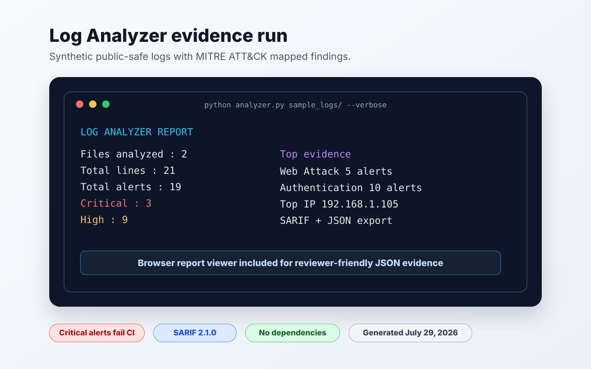

# Log Analyzer

A lightweight Python threat-detection engine for system and application logs.
It scans log files for attack indicators, suspicious behavior, and policy
violations, then maps alerts to MITRE ATT&CK techniques.

Built and maintained by [Omobolaji Adeyan](https://github.com/omobolajiadeyan)
as part of a practical security-engineering toolkit.

## Why This Matters

Logs are often the first place security teams look during an investigation.
This tool helps surface meaningful signals from authentication logs, web access
logs, system logs, and application logs without requiring a full SIEM setup.

## Features

- 13 built-in detection rules across 6 threat categories
- MITRE ATT&CK mapping for every alert
- JSON export with reviewer-friendly summary fields
- SARIF 2.1.0 export for GitHub Code Scanning
- Reusable GitHub Action wrapper
- Browser report viewer for exported JSON
- Top offending IP summary
- Zero third-party dependencies

## Current Evidence

The sample evidence run analyzes two public-safe synthetic log files and
produces 19 MITRE-mapped alerts across authentication, web attack, malware,
network, privilege-escalation, and persistence signals.



See [Project Evidence](docs/PROJECT_EVIDENCE.md) for exact commands, expected
sample counts, JSON/SARIF evidence, and tool boundaries. External reviewers can
use the [Evaluator Guide](docs/EVALUATOR_GUIDE.md) for a five-minute review.

## Detection Categories And Rules

| ID | Rule | Category | Severity | MITRE |
|---|---|---|---|---|
| AUTH-001 | Failed Login Attempt | Authentication | MEDIUM | T1110 |
| AUTH-002 | Multiple Failed Logins | Authentication | HIGH | T1110 |
| AUTH-003 | Root Login | Authentication | HIGH | T1078 |
| NET-001 | Port Scan Detected | Network | HIGH | T1046 |
| NET-002 | SQL Injection Attempt | Web Attack | CRITICAL | T1190 |
| NET-003 | XSS Attempt | Web Attack | HIGH | T1059.007 |
| NET-004 | Directory Traversal | Web Attack | HIGH | T1083 |
| SYS-001 | Privilege Escalation | Privilege Escalation | HIGH | T1548 |
| SYS-002 | Suspicious Command Execution | Execution | CRITICAL | T1059 |
| SYS-003 | File Deletion | Defense Evasion | HIGH | T1070.004 |
| SYS-004 | Cron Job Modified | Persistence | MEDIUM | T1053.003 |
| MAL-001 | Reverse Shell Indicator | Malware | CRITICAL | T1059.004 |
| MAL-002 | Tor/I2P Connection | Malware | HIGH | T1090.003 |

## Installation

```bash
git clone https://github.com/omobolajiadeyan/log-analyzer.git
cd log-analyzer
python --version
```

Python 3.10+ is recommended. No third-party packages are required.

## Local Usage

```bash
# Analyze a single log file
python analyzer.py sample_logs/auth.log

# Analyze all logs in a directory
python analyzer.py sample_logs/

# Show log-line context for each alert
python analyzer.py sample_logs/ --verbose

# Only show HIGH and CRITICAL alerts
python analyzer.py sample_logs/ --severity HIGH

# Export JSON
python analyzer.py sample_logs/ --output report.json

# Export SARIF for GitHub Code Scanning
python analyzer.py sample_logs/ --format sarif --output log-analyzer.sarif
```

Critical findings intentionally return exit code `2`, which makes the tool
useful in CI workflows where critical log evidence should fail the check.

## Browser Report Viewer

`web/` is a static report viewer for exported Log Analyzer JSON. It loads the
checked-in `web/sample-report.json` by default and can load a fresh JSON report
from your machine.

```bash
python analyzer.py sample_logs/ --output web/sample-report.json
cd web
python3 -m http.server 8080
```

Open `http://127.0.0.1:8080/` to inspect risk level, severity counts, top
offending IPs, categories, MITRE mappings, and alert snippets.

## GitHub Action Usage

```yaml
name: Log Analyzer

on:
  workflow_dispatch:
  pull_request:

permissions:
  contents: read
  security-events: write

jobs:
  analyze-logs:
    runs-on: ubuntu-latest
    steps:
      - uses: actions/checkout@v4
      - uses: omobolajiadeyan/log-analyzer@main
        with:
          path: sample_logs
          severity: HIGH
          output: log-analyzer.sarif
      - uses: github/codeql-action/upload-sarif@v3
        if: always()
        with:
          sarif_file: log-analyzer.sarif
```

## Output

The analyzer reports:

- rule ID and rule name
- severity
- category
- MITRE ATT&CK technique
- file and line number
- matching log-line context

JSON and SARIF outputs are designed for automation and review workflows.

## Project Structure

```text
log-analyzer/
|-- action.yml
|-- analyzer.py
|-- rules.py
|-- sample_logs/
|   |-- auth.log
|   `-- web_access.log
|-- tests/
|   `-- test_analyzer.py
|-- web/
|   |-- index.html
|   |-- app.js
|   |-- style.css
|   `-- sample-report.json
`-- README.md
```

## Limits

This tool is a lightweight detection aid, not a replacement for a full SIEM,
EDR, incident-response process, or tuned production detection pipeline. Treat
alerts as leads for investigation and validate them against your environment.

## Author

**Omobolaji Adeyan**  
Security Engineer and open-source security tooling maintainer  
[GitHub](https://github.com/omobolajiadeyan) | [Website](https://omobolajiadeyan.com)
